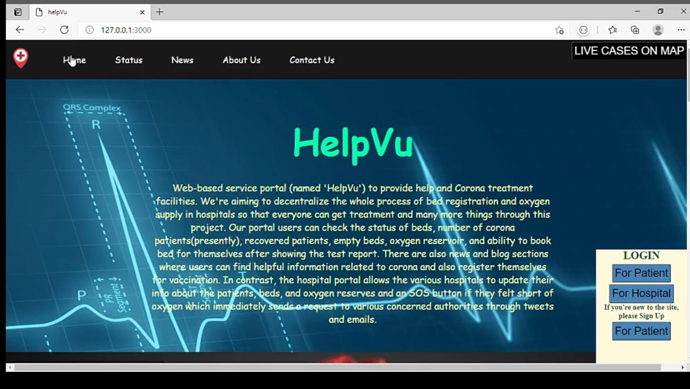
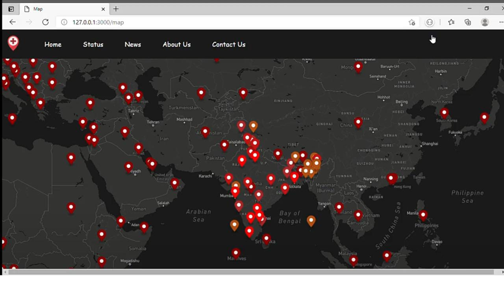
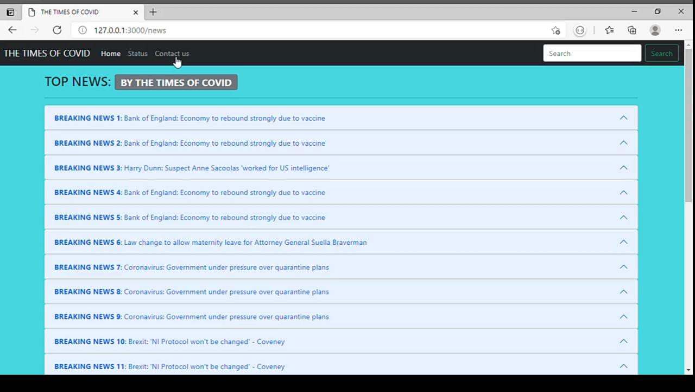

# HelpVu
This is a project for DevJam 4.0(MNNIT)

Currently, our country is going through a difficult time due to the
corona pandemic, and peoples are not even getting beds and oxygen
supply for their treatment. So we took it as a primary concern for our
country to help the peoples and came up with a Web-based service
portal (named 'HelpVu') to provide help and Corona treatment
facilities.

We're aiming to decentralize the whole process of bed registration in hospitals so
that everyone can get treatment and no one can lose their loved ones. Our portal
users can check the status of beds, number of corona patients(presently), recovered
patients, empty beds in their nearby hospital, and the ability to book bed for
themselves and their family members after showing the corona test report. We also
have a dedicated live map feature that extracts data from a live API and displays the
corona cases in different regions of the world in different colors as per the number of
cases. We also provide our users latest news extracted through a live news API to
keep our users updated with the world. In contrast, we also have a hospital portal
where various hospitals can login and provide/update their latest info about the
number of patients, beds, and oxygen reserves so that government and patients can
make arrangements accordingly.
 

<h2>Home Page</h2>

<h2>Live Map Page</h2>

<h2>News Page</h2>

 
<h4>Regards, 
Team Server_Monk</h4>
